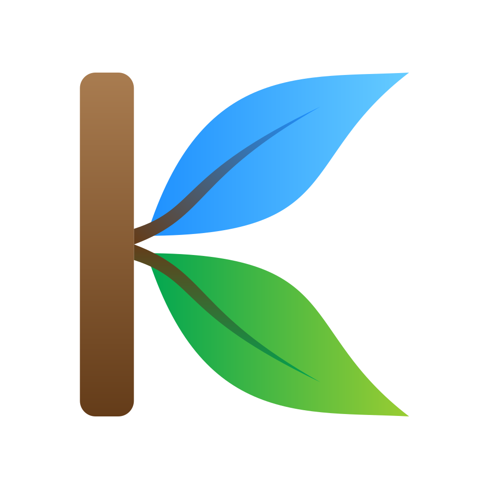

# Kaadu UI



## About Kaadu UI

Design system built for my personal projects.

## Features
- Light and Dark Theme Support
- Yellowgreen & Dodgerblue inspired color palette
- Modern, accessible UI components:
  - Styled text and number inputs
  - Buttons and links
  - Timeline lists
  - Radial progress
  - Expanders
  - Styled dialogs
  - Cards
  - Loading progress bar

## Getting Started

### 1. Installation

- You can clone this repository and copy the contents of the `src/` folder into your project, and use the files directly.
- Alternatively, use it directly from GitHub Pages:
    - https://shankarbus.github.io/kaadu-ui/kaadu-ui.css
    - https://shankarbus.github.io/kaadu-ui/kaadu-ui.js
    - https://shankarbus.github.io/kaadu-ui/radial-progress.js

### 2. Using Custom Controls

#### Radial Progress

```html
<radial-progress id="radialProgress" value="75" max="100" label="75%" color="red" size="100px"></radial-progress>
```

#### Expander

```js
import { createExpander, createKeyValueTable } from './kaadu-ui.js';
const expander = createExpander(
  [document.createTextNode('Header')],
  createKeyValueTable({ key: 'value' })
);
document.body.appendChild(expander);
```

#### Dialog

```js
import { createMessageDialog, showMessageDialog } from './kaadu-ui.js';
createMessageDialog();
showMessageDialog('Hello, this is a message dialog!');
```

## API Documentation

### `kaadu-ui.js`

- **`enableStickyHeader(offset = 50)`**: Makes the header sticky after scrolling past the offset.
  - **Arguments:**
    - `offset` (number, optional): The scroll offset in pixels after which the header becomes sticky. Default is 50.

- **`createExpander(buttonContents, panelContent, buttonClass = '')`**: Creates a collapsible expander panel.
  - **Arguments:**
    - `buttonContents` (Array<Node>): Array of DOM nodes to display in the expander button.
    - `panelContent` (Node): DOM node to show inside the expander panel.
    - `buttonClass` (string, optional): Additional CSS class for the expander button.

- **`addKeyValueRowToTable(table, label, value)`**: Adds a key-value row to a table.
  - **Arguments:**
    - `table` (HTMLTableElement): The table to add the row to.
    - `label` (string): The key/label for the row.
    - `value` (string | Node): The value for the row (can be a string or DOM node).

- **`createKeyValueTable(obj, valuefun = null)`**: Creates a table from a JS object.
  - **Arguments:**
    - `obj` (object): The object to convert to a key-value table.
    - `valuefun` (function, optional): A function to transform each value into an HTML element.

- **`createMessageDialog(id = null)`**: Creates a basic text message dialog in the DOM.
  - **Arguments:**
    - `id` (string, optional): The ID to assign to the dialog element.

- **`showMessageDialog(message, title = null, id = null)`**: Displays a message in the dialog.
  - **Arguments:**
    - `message` (string): The message to display inside the dialog.
    - `title` (string, optional): The title for the dialog.
    - `id` (string, optional): The ID of the dialog to show.

- **`hideMessageDialog(id = null)`**: Hides the message dialog.
  - **Arguments:**
    - `id` (string, optional): The ID of the dialog to hide.

### `radial-progress.js`

- **RadialProgress**: Custom element `<radial-progress>` for a circular progress indicator.
  - **Attributes:**
    - `value` (number): Progress value (0-`max`).
    - `max` (number, optional): Maximum value (default: 100).
    - `label` (string, optional): Text label shown in the center.
    - `color` (string, optional): Stroke color of the progress arc (default: Focus color).
    - `size` (string, optional): Size of the component (e.g., `80px`).

## Styling

- All styles are in `kaadu-ui.css`.
- Uses CSS variables for easy theming.
- Responsive and accessible.

## License

This project is licensed under the MIT License. See [LICENSE](LICENSE) for details.
