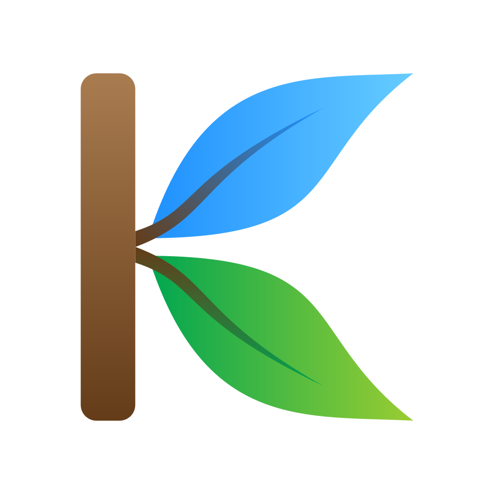

# Kaadu UI

A theme-aware, nature-inspired UI design system with blur effects, console-style typography, and components with green aesthetics.



## About Kaadu UI

**Kaadu UI** is a theme-aware, nature-inspired UI design system. It features blur effects, console-style typography, and components with green aesthetics. The system is designed for clarity, accessibility, and a modern look, making it ideal for applications that want a fresh, natural feel.

Its purpose is to provide a consistent, visually appealing set of controls and layouts that adapt to both light and dark themes, with a focus on usability and style.

## Features
- Theme-aware (light/dark mode)
- Blur and overlay effects
- Console-style typography (Cascadia Code)
- Green, nature-inspired color palette
- Modern, accessible UI components:
  - Styled text and number inputs
  - Buttons and links
  - Timeline lists
  - Combo box (custom dropdown)
  - Radial progress (circular progress indicator)
  - Expanders (collapsible panels)
  - Popups
  - Cards
  - Loading progress bar

## Getting Started

### 1. Installation

- You can clone this repository and copy the contents of the `src/` folder into your project, and use the files directly.
- Alternatively, use Kaadu UI directly from GitHub Pages CDN:
    - https://shankarbus.github.io/kaadu-ui/kaadu-ui.css
    - https://shankarbus.github.io/kaadu-ui/kaadu-ui.js
    - https://shankarbus.github.io/kaadu-ui/combo-box.js
    - https://shankarbus.github.io/kaadu-ui/radial-progress.js

### 2. Basic HTML Template

Here is a minimal template to get started:

```html
<!DOCTYPE html>
<html lang="en">
<head>
    <meta charset="UTF-8">
    <meta name="viewport" content="width=device-width, initial-scale=1.0">
    <title>Kaadu UI Example</title>
    <link rel="stylesheet" href="https://shankarbus.github.io/kaadu-ui/kaadu-ui.css">
    <script type="module" src="https://shankarbus.github.io/kaadu-ui/kaadu-ui.js"></script>
    <script type="module" src="https://shankarbus.github.io/kaadu-ui/combo-box.js"></script>
    <script type="module" src="https://shankarbus.github.io/kaadu-ui/radial-progress.js"></script>
</head>
<body>
    <div class="dotted-background"></div>
    <div class="overlay-background"></div>
    <div id="smokeBackground" class="nav-smoke-background"></div>
    <header id="pageHeader" class="page-header">
        <button class="hamburger" id="hamburgerMenu">
            <div></div>
            <div></div>
            <div></div>
        </button>
        <label>Title</label>
        <nav id="navBar" class="navbar">
            <ul id="navList" class="navlist">
                <li><a href="#header">Header</a></li>
            </ul>
        </nav>
    </header>
    <div id="main">
        <div class="column">
            <div class="group">
                <h2 id="header">Header</h2>
                <div class="sub-group">
                    <h3>Sub Header</h3>
                    <p>Content here.</p>
                </div> 
            </div>
        </div>
    </div>
    <footer id="pageFooter" class="page-footer">
        <button class="footer-button" role="button"></button>
    </footer>
</body>
</html>
```

### 3. Using Custom Controls

#### Combo Box

```html
<combo-box id="cmbBox" placeholder="Select an item"></combo-box>
```

```js
import { ComboBox } from './combo-box.js';
const data = [
  { value: 'OPT1', label: 'Option 1' },
  { value: 'OPT2', label: 'Option 2' },
];
document.getElementById('cmbBox').loadOptions(data);
```

### Radial Progress

```html
<radial-progress id="radialProgress" value="75" max="100" label="75%" color="red" size="100px"></radial-progress>
```

#### Expander

```js
import { createExpander, createKeyValueTable } from './kaadu-ui.js';
const expander = createExpander(
  [document.createTextNode('Header')],
  createKeyValueTable({ key: 'value' })
);
document.body.appendChild(expander);
```

#### Popup

```js
import { setupMessagePopup, showMessagePopup } from './kaadu-ui.js';
setupMessagePopup();
showMessagePopup('Hello, this is a message popup!');
```

## API Documentation

### `kaadu-ui.js`

- **`enableStickyHeader(offset = 50)`**: Makes the header sticky after scrolling past the offset.
  - **Arguments:**
    - `offset` (number, optional): The scroll offset in pixels after which the header becomes sticky. Default is 50.

- **`enableFloatingFooter()`**: Enables a floating footer that becomes fixed at the bottom of the viewport when scrolling.

- **`enableHamburgerMenu()`**: Enables hamburger menu for responsive navigation.

- **`createExpander(buttonContents, panelContent, buttonClass = '')`**: Creates a collapsible expander panel.
  - **Arguments:**
    - `buttonContents` (Array<Node>): Array of DOM nodes to display in the expander button.
    - `panelContent` (Node): DOM node to show inside the expander panel.
    - `buttonClass` (string, optional): Additional CSS class for the expander button.
  - **Usage Example:**
    ```js
    import { createExpander } from './kaadu-ui.js';
    const expander = createExpander(
      [document.createTextNode('Show Details')],
      document.createTextNode('Here are the details!'),
      'my-expander-btn'
    );
    document.body.appendChild(expander);
    ```

- **`addKeyValueRowToTable(table, label, value)`**: Adds a key-value row to a table.
  - **Arguments:**
    - `table` (HTMLTableElement): The table to add the row to.
    - `label` (string): The key/label for the row.
    - `value` (string | Node): The value for the row (can be a string or DOM node).
  - **Usage Example:**
    ```js
    import { addKeyValueRowToTable } from './kaadu-ui.js';
    const table = document.createElement('table');
    addKeyValueRowToTable(table, 'Name', 'Kaadu UI');
    document.body.appendChild(table);
    ```

- **`createKeyValueTable(obj, valuefun = null)`**: Creates a table from a JS object.
  - **Arguments:**
    - `obj` (object): The object to convert to a key-value table.
    - `valuefun` (function, optional): A function to transform each value into an HTML element.
  - **Usage Example:**
    ```js
    import { createKeyValueTable } from './kaadu-ui.js';
    const data = { version: '1.0', author: 'Shankar' };
    const table = createKeyValueTable(data);
    document.body.appendChild(table);
    ```

- **`setupMessagePopup()`**: Sets up a popup in the DOM.

- **`showMessagePopup(message)`**: Shows a message in the popup.
  - **Arguments:**
    - `message` (string): The message to display in the popup.

- **`hideMessagePopup()`**: Hides the popup.

### `combo-box.js`

- **ComboBox**: Custom element `<combo-box>` for a dropdown.
  - **`loadOptions(options)`**: Loads options (array of `{ value, label }`).
  - **`getSelectedItem()`**: Returns the selected item.
  - **`setSelectedItem(value)`**: Sets the selected item by value.
  - **`selectionChanged`**: Event fired when selection changes.

#### Example:
```js
const combo = document.getElementById('cmbBox');
combo.loadOptions([
  { value: 'A', label: 'Option A' },
  { value: 'B', label: 'Option B' }
]);
combo.addEventListener('selectionChanged', e => {
  console.log('Selected:', e.detail);
});
```

### `radial-progress.js`

- **RadialProgress**: Custom element `<radial-progress>` for a circular progress indicator.
  - **Attributes:**
    - `value` (number): Progress value (0-`max`).
    - `max` (number, optional): Maximum value (default: 100).
    - `label` (string, optional): Text label shown in the center.
    - `color` (string, optional): Stroke color of the progress arc (default: Focus color).
    - `size` (string, optional): Size of the component (e.g., `80px`).
  - **Properties:**
    - `.value`, `.max`, `.label`, `.color`, `.size` (getters/setters for the above attributes)
  - **Usage Example:**
    ```html
    <radial-progress value="75" max="100" label="75%" color="red" size="100px"></radial-progress>
    ```
    ```js
    const rp = document.getElementById('radialProgress');
    rp.value = 90;
    rp.label = '90%';
    rp.color = 'dodgerblue';
    rp.size = '120px';
    ```

## Styling

- All styles are in `kaadu-ui.css`.
- Uses CSS variables for easy theming.
- Responsive and accessible.

## License

This project is licensed under the MIT License. See [LICENSE](LICENSE) for details.